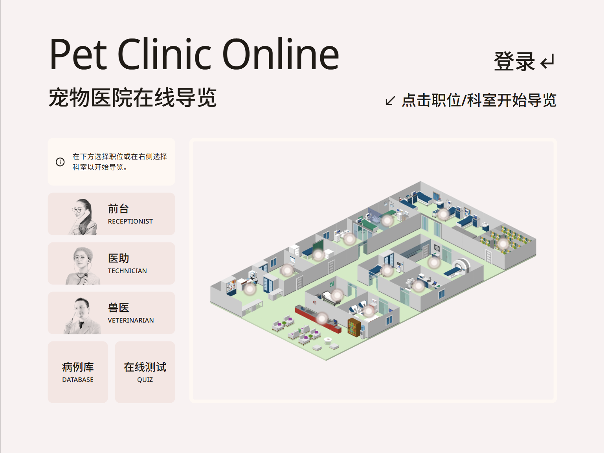

# Pet Clinic Online

This is a Next.js project bootstrapped with [`create-next-app`](https://github.com/vercel/next.js/tree/canary/packages/create-next-app).
Visit our live demo at [pet-clinic.homans.world](https://pet-clinic.homans.world).



本课程项目旨在帮助兽医学生更好地学习相关知识。为此我们建立了一个虚拟的宠物诊所，用户可以在这里进行学习和练习。结项汇报请参考[在线演示文档](https://www.figma.com/proto/F97rlV8lIfX4KTrk71Kijc/Pet-Clinic-Prototype-v2.0?node-id=53988-27561)。

项目无需后端也可以正常运行，但是 `learn` 和 `quiz` 模块中的数据获取依赖[后端项目](https://github.com/MxaWnag/PetClinic)。如需在生产环境部署请参考[项目部署说明](docs/项目部署说明.md)，其中包括前后端的部署方法，包括 MariaDB、Docker、Jenkins 管理面板和域名访问的配置方法。如仅需运行此前端项目请继续阅读。

本项目在结项后有持续的维护和更新，如需要查看结项时的代码快照请参考 2023 年的最后一个提交。

## Getting Started

1. Install dependencies.

    ```bash
    npm install
    ```

2. Run the development server.

    ```bash
    npm run dev
    ```

3. Goto [http://localhost:3000](http://localhost:3000) in your browser.

## App Routing

This project uses dynamic routes to reuse codes between pages.
Routes like `/job/receptionist/article-a` and `/job/veterinarian/article-b`
is matched by `app/(intro)/job/[jobName]/[articleSlug].tsx`.
Metadata of each route is prescribed in `contents`.
Most of the routes are listed below.

> We are migrating from Next.js Pages Router to App Router.
> Currently, Pages Router and App Router coexist in this project.
> The routes below are for reference only, some of the files are in the app folder now.

```txt
pages/
│
├── job/
│   ├── receptionist/ 前台
│   ├── technician/ 医助
│   └── veterinarian/ 兽医
│
├── tour/
│   ├── reception/ 前台区
│   ├── records-dept/ 档案室
│   ├── outpatient-room/ 门诊室
│   ├── vaccination-room/ 免疫室
│   ├── laboratory/ 化验室
│   ├── treatment-room/ 治疗室
│   ├── radiology-room/ 影像学检查室
│   ├── pharmacy/ 药房
│   ├── infusion-room/ 输液室
│   ├── preparation-area/ 手术准备室
│   ├── operating-room/ 手术室
│   ├── inpatient-ward/ 住院部
│   └── autopsy-room/ 病理剖检室
│
├── learn/
│   ├── case-study/ 病例数据库
│   ├── examination/ 检查数据库
│   └── medication/ 药品数据库
│
├── quiz/
│   ├── [id] 试卷
│   └── index.tsx 随机测试
│
├── index.tsx 主页
├── login.tsx 登录
└── sign-up.tsx 注册
```

## Environment Variables

`.env.development` and `.env.production` are default environment variables
used in `development` (`next dev`) and `production` (`next start`)
environment respectively.

Make your own changes in a new file `.env.local` to override the default ones.

## Learn More

To learn more about Next.js, take a look at the following resources:

- [Next.js Documentation](https://nextjs.org/docs) - learn about Next.js features and API.
- [Learn Next.js](https://nextjs.org/learn) - an interactive Next.js tutorial.

You can check out [the Next.js GitHub repository](https://github.com/vercel/next.js/) - your feedback and contributions are welcome!

## Deploy on Vercel

The easiest way to deploy your Next.js app is to use the [Vercel Platform](https://vercel.com/new?utm_medium=default-template&filter=next.js&utm_source=create-next-app&utm_campaign=create-next-app-readme) from the creators of Next.js.

Check out [Next.js deployment documentation](https://nextjs.org/docs/deployment) for more details.
